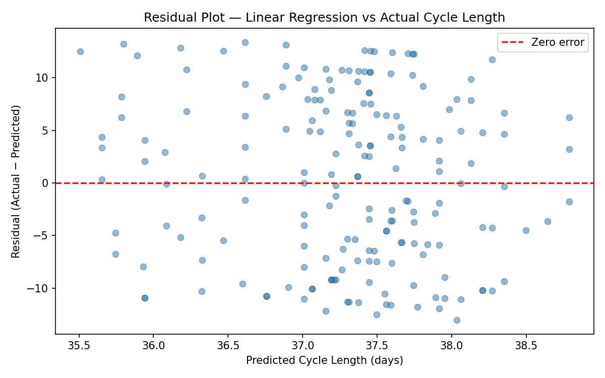

# Menstrual Cycle Length Prediction
### Multiple Linear Regression · Scikit-learn · Python 3.12

---

## Research Question

Can demographic and lifestyle factors — age, BMI, sleep hours, stress level,
exercise frequency, and diet — predict menstrual cycle length without relying
on personal cycle history?

---

## Result

**No — not meaningfully.**

The model achieves R² ≈ 0 and MAE of ~6.93 days, performing no better than
predicting the population mean for every individual. This is a valid scientific
finding: the selected features carry negligible predictive signal for cycle
length at the population level.

---

## Dataset

- **Source:** [Menstrual Cycle Data with Factors — Kaggle](https://www.kaggle.com/datasets/akshayas02/menstrual-cycle-data-with-factors-dataset)
- **Size:** 895 rows · 100 unique users · ~9 cycles per user
- **Structure:** Longitudinal — multiple cycle records per person

---

## Features

| Feature | Type | Preprocessing |
|---|---|---|
| Age | Numeric | Z-score standardized |
| BMI | Numeric | Z-score standardized |
| Stress Level (1–5) | Numeric | Z-score standardized |
| Sleep Hours | Numeric | Z-score standardized |
| Period Length | Numeric | Z-score standardized |
| Exercise Frequency | Categorical | One-hot (baseline: Low) |
| Diet | Categorical | One-hot (baseline: Vegetarian) |

**Target:** `Cycle Length` (days)

---

## Methodology

### Data Splitting — GroupShuffleSplit
The dataset contains multiple rows per user. A naive random split would place
the same user in both train and test — leaking information and inflating
performance. We use `GroupShuffleSplit` to ensure all rows for a given user
go entirely to one split.
```
Train: 706 rows (80 users)
Test:  189 rows (20 users)
```

### Baseline Model
Before training any model, we establish a naive baseline: predict the mean
cycle length of the training set for every test sample. Any model that cannot
beat this has learned nothing useful.
```
Baseline mean prediction: 37.27 days
```

### Standardization
Numeric features are standardized using `StandardScaler` fit **on training
data only**. The same fitted scaler transforms the test set. Fitting on the
full dataset would leak test distribution information into training.

---

## Results

| Metric | Baseline | Linear Regression | Improvement |
|---|---|---|---|
| MAE (days) | 6.8893 | 6.9299 | -0.0406 ❌ |
| RMSE (days) | 7.8009 | 7.8385 | -0.0376 ❌ |
| R² | ~0.00 | -0.013 | -0.010 ❌ |

The linear regression model does not outperform the mean baseline on any
metric. The model's predictions cluster tightly between 35.5–38.5 days for
all test samples — it fails to differentiate meaningfully between individuals.

---

## Residual Plot



Residuals are large (±10–12 days) and symmetric around zero. The narrow
prediction range (3 days) relative to the actual range (25–50 days) confirms
the model has found no meaningful signal in the available features.

---

## Coefficient Table

| Feature | Coefficient | Direction |
|---|---|---|
| Diet_High Sugar | +0.818 | longer cycle |
| Diet_Balanced | +0.727 | longer cycle |
| Exercise Frequency_High | +0.693 | longer cycle |
| Exercise Frequency_Moderate | +0.471 | longer cycle |
| Diet_Low Carb | +0.335 | longer cycle |
| Age | -0.330 | shorter cycle |
| BMI | +0.297 | longer cycle |
| Sleep Hours | +0.285 | longer cycle |
| Period Length | -0.200 | shorter cycle |
| Stress Level | +0.148 | longer cycle |

Coefficients are on standardized scale. No single feature exerts strong
influence — the largest coefficient (0.818) is small in the context of a
target with standard deviation of ~7.5 days.

---

## Project Structure
```
cycle-regression-project/
├── data/
│   ├── raw/                  # original Kaggle CSV (unmodified)
│   └── processed/            # cleaned outputs
├── src/
│   ├── preprocess.py         # cleaning, encoding, splitting, scaling
│   ├── train.py              # baseline + linear regression training
│   └── evaluate.py           # metrics, comparison, error analysis
├── tests/
│   └── test_preprocess.py    # 11 tests covering shape, leakage, encoding
├── reports/
│   ├── metrics.json          # saved evaluation results
│   ├── residual_plot.png     # visual error analysis
│   └── coefficients.csv      # feature influence table
├── models/
│   └── linear_regression.pkl # saved trained model
├── config.py                 # all paths, column names, constants
├── main.py                   # single entry point
└── requirements.txt
```

---

## How To Run
```bash
# 1. Create and activate virtual environment
python -m venv .venv
source .venv/bin/activate

# 2. Install dependencies
pip install -r requirements.txt

# 3. Place Kaggle CSV in data/raw/menstrual_cycle_data.csv

# 4. Run full pipeline
python main.py

# 5. Run tests
python -m pytest tests/test_preprocess.py -v
```

---

## Limitations

- **No cycle history features** — prior cycle length is the strongest known
  predictor of next cycle length. This project intentionally excludes it to
  isolate the contribution of lifestyle/demographic factors alone.
- **Small unique user count** — 100 users limits generalizability.
- **Self-reported data** — stress, sleep, and diet labels may be imprecise.
- **Linear model only** — non-linear relationships (e.g. Age²) were not explored.

---

## Future Work

- Add EDA notebook with distribution plots and correlation heatmap
- Test polynomial features (Age², BMI²) to capture non-linear effects
- Compare R² against a model that includes previous cycle length — quantify
  how much history improves prediction
- Try Ridge/Lasso regression to assess whether regularization helps

---

## Dependencies

- Python 3.12
- scikit-learn
- pandas
- numpy
- matplotlib
- pytest
```

---

## ✅ Your Action Items

**1.** Save as `README.md` at the project root

**2.** Update your `requirements.txt` to match what you actually installed:
```
scikit-learn
pandas
numpy
matplotlib
pytest
```

**3.** Make sure `data/raw/` is in your `.gitignore` if you plan to push to GitHub — never commit raw data files publicly, especially health data:
```
# .gitignore
data/raw/
models/
.venv/
__pycache__/
.pytest_cache/